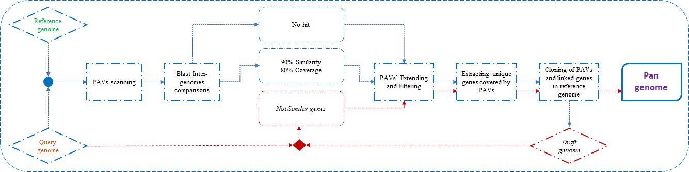

# ppsPCP
A Plant PAVs Scanner and Pan-genome Construction Pipeline.
## Description
Eukaryotic pan-genome studies have employed several approaches to avoid the difficulty of generating many high-quality genome assemblies: using reference genome-based approaches with targeted de novo assembly, focusing on a small number of relatively low quality de novo assemblies; employing a metagenome approach that combines low depth sequences from many lines with targeted de novo assembly; or creating a pan-transcriptome as a way to reduce complexity. While these studies all have limited ability to capture and describe the full nuclear pan-genome, most suggest a pan-genome that is considerably larger than the genome of any individual line. By taking into account, We developed a new pipeline: ppsPCP. Different from previous studies, this pipeline takes advantage form already assembled high quality genomes, and will use both sequence and annotation based information to develop a complete pan-genome for eukaryotes, specially for plants. 

When comparing two genome assemblies A and B, the ppsPCP pipeline looks for sequences present in A (query-genome) but absent in B (reference-genome) and vice versa. The following figure schematically shows the steps implemented in the pipeline:



The fundamental steps performed are:
1. The query and reference genomes are aligned together. MUMmer was used for whole genome comparisons as follows: first NUCmer alignment package calculated the delta file, then the show-coords utility parsed this delta alignment output;
2. The alignments are processed to filter out small repeats and to identify the mapping coordinates. The smallest size of PAVs extracted is 100bp;
3. To confirm the presence of PAVs among the genomes, BLASTn analyses against each other are performed;
4. BLASTn results are parsed to class the PAVs scaffolds into three different categories: 
   - Similar (to the reference tested), similarity is minimal 90% and coverage higher than 80%;
   - Less Similar: similarity is below 90% and coverage less than 80%;
   - No hits on the reference used;
5. PAVs are compared with the reference genome annotation file and those which were adjacent to each other and having some overlapping gene sequence are extended and merged into a single one; 
6. In house Perl script is used to extract the genes which were associated with the PAVs and make a PAVs annotation file;
7. To make sequence based pan genome, filtered PAVs and annotation files are merged with reference genome fasta and annotation file;
8. After making the sequence based pan genome, it is aligned again with the query sequence to get the not similar genes information which at least not following one of the previous defined criteria;
9. Filtered not similar genes then added into files generated at ***step 5*** and repeated the ***steps 5 and 6***. By this way, ppsPCP collects not only sequence based PAVs and its associated genes, but also collect the genes which are less similar or may be found in the shell region. 
10. Finally, new sequence and annotation files are added to reference genome sequence and annotation files respectively. This will yield a complete pan genome which contains sequence as well as gene based on PAVs information and represent a whole gene set for both genomes.

## Dependencies
### System requirement
ppsPCP currently only supports  ***Linux*** system due to the software dependencies. If your system also supports multiple threads, you can assign them through '--thread' parameter, which will be used in the Blastn step to improve the speed.
### Softwares
1. MUMmer  
You can find MUMmer [HERE](http://mummer.sourceforge.net/). Installing MUMmer is quite easy:
```
$ wget https://sourceforge.net/projects/mummer/files/latest/download
$ tar -xvzf MUMmerX.X.tar.gz (X means the VERSION of MUMmer)
$ make check
$ make install
# Add MUMmer tools to your PATH
$ export PATH=/path/to/MUMmer/:$PATH
```
2. Blast+  
You can find Blast+ [HERE](https://blast.ncbi.nlm.nih.gov/Blast.cgi) in NCBI. Here we download the x64-linux version of Blast+.
```
$ wget ftp://ftp.ncbi.nlm.nih.gov/blast/executables/blast+/LATEST/ncbi-blast-2.7.1+-x64-linux.tar.gz
$ tar zxvf ncbi-blast-2.7.1+-x64-linux.tar.gz
# Add Blast+ tools to your PATH
$ export PATH=/path/to/blast+/bin:$PATH
```
3. Bedtools  
[Bedtools](https://bedtools.readthedocs.io/en/latest/) is a powerful toolset for genome arithmetic. It is also very easy to install. In this pipeline, four sub-tools from Bedtools are used: *getfasta*, *intersect*, *merge* and *sort*.
```
$ wget https://github.com/arq5x/bedtools2/releases/download/v2.25.0/bedtools-2.25.0.tar.gz
$ tar -zxvf bedtools-2.25.0.tar.gz
$ cd bedtools2
$ make
# Add Bedtools tools to your PATH
$ export PATH=/path/to/bedtools/bin:$PATH
```
4. Blat  
[Blat](https://en.wikipedia.org/wiki/BLAT_(bioinformatics)) is one of utilities from UCSC. You can select one utility to download or use below commad to download all of them from this [page](http://hgdownload.soe.ucsc.edu/admin/exe/linux.x86_64/).
```
$ mkdir UCSC_tools
$ rsync -aP rsync://hgdownload.soe.ucsc.edu/genome/admin/exe/linux.x86_64/ ./
#Add blat to your PATH
export PATH=/path/to/UCSC_tools/blat/:$PATH
```
5. gffread  
gffread is a build-in tool in [Cufflinks](http://cole-trapnell-lab.github.io/cufflinks/manual/).So by installing cufflinks, you can use gffread easily.
```
$ wget http://cole-trapnell-lab.github.io/cufflinks/assets/downloads/cufflinks-2.2.1.Linux_x86_64.tar.gz
$ tar zxvf cufflinks-2.2.1.Linux_x86_64.tar.gz
# Add gffread to your PATH
$ export PATH=/path/to/cufflinks-2.2.1.Linux_x86_64/:$PATH
```
6. Perl and perl modules  
In most Linux system, perl is a standard part of build-in softwares. The only problem is that the version of perl maybe too low. Here we recommand the version of perl should be least *5.10.0* (use *perl -v* to check the version). Although most of the modules ppsPCP used already exist, you still need to install the [Bio::Perl](http://www.bioperl.org/) module. Installing the perl module under Linux system sometimes can be troublesome due to the lack of adminstrator permission. This [page](https://bioperl.org/INSTALL.html) inrtoduces three ways to install the Bio::Perl module, but in practice the *cpanm* is the most friendly way to install perl module. You can find a pre-compiled source code for the cpanm [HERE](https://github.com/miyagawa/cpanminus/tree/devel/App-cpanminus)
```
#if you are using cpanm for the first time, type the following command on your system.(By default, the module installed through cpanm will be in '~/perl5' directory).
$ cpanm --local-lib=~/perl5 local::lib && eval $(perl -I ~/perl5/lib/perl5/ -Mlocal::lib)
# install Bio::Perl
$ cpanm Bio::Perl
```
## Install ppsPCP
Installing ppsPCP can be very easy. Simply download and uncompress the ppsPCP package, then put the bin directory into your PATH.
## Test ppsPCP with example data
A small dataset in the 'example' directory can be used to test whether ppsPCP can run on your system successfully or not. Move to the 'example' directory and type the following commands:
```
$ cd example
$ 
```
If any error occurs, please check the log information or contact us through e-mail.
## Input and output files
### Input files
At least two genome sequence files and two corresponding annotation files are required to run ppsPCP.

The genome sequence file should be a fasta file with following format:
```
>chr1
ATCGATCG...
```
File extension doesn't matter, '.fa', '.fasta' or any other suffix can be accepted. But the prefix name of sequence file will be used to indicate the temporary file, so we recommend you to use 'cultivar.fa (like rice.fa)' to run ppsPCP.

Annotation file should be [GFF3](https://github.com/The-Sequence-Ontology/Specifications/blob/master/gff3.md GFF3) format:
```
ctg123 . gene            1000  9000  .  +  .  ID=gene00001;Name=EDEN
ctg123 . mRNA            1050  9000  .  +  .  ID=mRNA00001;Parent=gene00001;Name=EDEN.1
ctg123 . exon            1300  1500  .  +  .  ID=exon00001;Parent=mRNA00003
ctg123 . CDS             1201  1500  .  +  0  ID=cds00001;Parent=mRNA00001;Name=edenprotein.1
```
Although it is possible to construct a pan-genome without any annotation information, but then the downstream analyses can only be done based on sequence. So we strongly recommend you to create annotation file for your genome. There are lots of excellent tools to annote a genome, like [Maker](http://www.yandell-lab.org/software/maker.html), [PASA](https://github.com/PASApipeline/PASApipeline/wiki) and so on.
### Output files
The main output files of ppsPCP are 'pangenome.fa' and 'pangenome.gff3' if you create pan-genome with two genome (one reference and one query), as well as some useful information about the pan-genome like number of PAVs in query, number of genes merged into pan-genome and so on. ppsPCP supports multiple query genome files, which will produce 'pangenome1.fa', 'pangenome2.fa'... et al, with corresponding gff3 file for each of them.
## Examlpe commands
Type 'make_pan.pl -h' for a detailed look at the parameters in ppsPCP.

If you have only one query genome: 
```
make_pan.pl --ref cultivar1.fa --ref_anno cultivar1.gff3 --query cultivar2.fa --query_anno cultivar2.gff3
```
If you have multiple query genomes:
```
make_pan.pl --ref cultivar1.fa --ref_anno cultivar1.gff3 --query cultivar2.fa cultivar3.fa ... --query_anno cultivar2.gff3 cultivar2.gff3 ...
```

We also provide some other useful parameters to control the performance of ppsPCP. *--coverage*, *--sim_pav* and *--sim_gene* are used to filter out similar PAVs and genes described in above steps. We strongly suggest using multiple threads through*--thread*, witch can significantly improve the speed of blastn.

## Contact us
- Tahir, m.tahirulqamar@webmail.hzau.edu.cn
- Zhu xitong, z724@qq.com (E-mail can be in Chinese)

1235456
